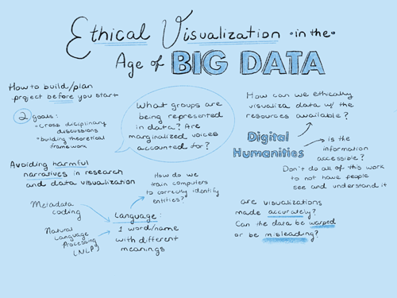

# Ethical Visualization in the Age of Big Data: Contemporary Cultural Implications of Pre-Twentieth-Century French Texts
### Planning Workshop Summary

------------------------------
##### A workshop to seek interdisciplinary expert perspectives on ethically and visually representing the historical place of misrepresented peoples and locales.

** Held on **
9–10 January, 2020  
**At ** Lincoln Hall, [University of Nevada, Reno](https://www.unr.edu) 1664 N. Virginia St
Reno, Nevada, U.S.A.  
** Organized by **  Katherine Hepworth [website](https://kathep.com) & Christopher Church [website](http://www.christophermchurch.com/)

------------------------------
## Details

### The workshop
- [Program](#Program)
- [Participants](#participants)
- [Dataset](#dataset)
- [Documents](#documents)
- [Credits](#credits)

### What's next
- [Future activities](#future-activities)
- [Reflections](#reflections)
- [Participate](#participate)

------------------------------

## Program
Download the program [pdf](link) here.

### Sessions
- [1 | Scholarly framing (digital humanities & French colonial history)](1.md)
- [2 | Metadata structure](2.md)
- [3 | Natural language processing (NLP) workflow](3.md)
- [4 | Domain adaptation (for early modern French)](4.md)
- [5 | Ethical data visualization](5.md)
- [6 | Mapping and interface design usability](6.md)
- [7 | Adapting and integrating existing open source projects](7.md)
- [8 | Input and output (i/o), ongoing maintenance & preservation](8.md)

&nbsp;
-----------------------------

## Participants

### Organizers
- **Christopher M. Church**  
    Assistant Professor of Digital History  
    Co-Director, Nevada Center for Data and Design  
    Department of History  
    University of Nevada, Reno
- **Katherine Hepworth**  
    Associate Professor of Visual Journalism  
    Co-Director, Nevada Center for Data and Design  
    Research Director, Visualizing Science Project  
    The Reynolds School of Journalism  
    University of Nevada, Reno

### Advisor
- **Karel van der Waarde**  
    Professor of Visual Communication  
    Swinburne University of Technology  
    Melbourne, Australia

### Participants
- **Charles Tshimanga-Kashama**  
    Associate Professor of History  
    Department of History  
    University of Nevada, Reno  
- **Katherine McDonough**  
    Senior Research Associate  
    The Alan Turing Institute  
    British Library  
    London, United Kingdom  
- **Ludovic Moncla**  
    Maître de conférences in computer science  
    Computer Science Laboratory for Image Processing and Information Systems (LIRIS)
    National Institute of Applied Sciences (insa)  
    Lyon, France  
- **David Bamman**  
    Assistant Professor  
    Information School  
    University of California  
    Berkeley, U.S.A.  
- **Mary Elings**  
    Assistant Director and Head of Technical Services
    The Bancroft Library  
    University of California  
    Berkeley, U.S.A.  
- **Claire Gardent**  
    CNRS/LORIA  
    Université de Lorraine  
    Nancy, France  
- **Doris Kosminsky**  
    Professor  
    School of Fine Arts  
    Universidade Federal do Rio de Janeiro  
    Rio de Janeiro, Brazil  
- **Teresa Schultz**  
    Assistant Professor  
    University Libraries  
    University of Nevada, Reno  
- **Elena Azadbakht**  
    Health Sciences Librarian  
    University Libraries  
    University of Nevada, Reno  

### Support staff
- **Aya Sato**  
    Journalism senior  
    Reynolds School of Journalism  
    University of Nevada, Reno

&nbsp;
------------------------------

## Dataset
Something goes here

### Formatted data
- [Link](link)
  Description goes here
- [Link](link)
  Description goes here
- [Link](link)
  Description goes here

### Memorandum of understanding
Something goes here

### Data processing notes
|Version    |Date   |Note   |
|:---|:---|:---|
| Version 3.1 | April 2020  | Ethical Visualization for Impact  |
| [Version 3.0](ethical_visualization_3_0.md) | March 2020  | Ethical Visualization for Impact  |
| [Version 2.1](ethical_visualization_2_1.md) | October 2019  | Ethical Visualization  |
| [Version 2.0](ethical_visualization_2_0.md)   | October 2019  | Ethical Visualization  |
| [Version 1.1](ethical_visualization_1_1.md)   | May 2019  | Ethical Visualization  |
| [Version 1](ethical_visualization_1_0.md)   | December 2018  | Ethical Visualization Workflow  |

&nbsp;
-----------------------------

## Participate

### Follow
You can follow development of this work by subscribing to Dr Katherine Hepworth's newsletter at https://broaderimpacts.substack.com.

### Contribute
If you'd like to contribute to the development of this work, please reach out at khepworth at unr dot edu. Referrals to other projects, literature, and methods that may be relevant are welcome, as well as suggestions for improvement or other modes of implmentation. 

### Project help
Have a high-stakes visualization you need to make an impact? There are a limited number of spots available for client work under the auspices of the Mick Hitchcock Ph.D. Project for Visualizing Science. To express your interest, reach out at khepworth at unr dot edu.

&nbsp;
-----------------------------

## Credits

### Citation
From Hepworth, K. 2020. (forthcoming) "Make Me Care: Ethical Visualization for Impact in the Sciences and Data Sciences", *HCII Conference 2020 Proceedings*.

### Funding
The following institutions have supported development of this method.
- Nevada NASA (National Aeronautics and Space Administration) Space Grant Consortium, Award No. NNX15AI02H
- National Endowment of the Humanities Office of Digital Humanities, Award No. HAA-266490-19
- University of Nevada, Reno, various internal grants
- Mick Hitchcock Ph.D. Project for Visualizing Science

### Acknowledgements
Acknowledgement of previous versions can be found in the documentation for each one, listed below. In addition to previous contributions, I am grateful for the contributions, discussion, and feedback on this version from [Sage Cheng](https://www.accessnow.org/profile/sage-cheng/) at Access Now, Sonia Jalfin at [Sociopublico](http://sociopublico.com/en/us.php), [Max Frischknecht](https://maxfrischknecht.ch/) of Bern University of the Applied Arts, and [Georgia Bullen](https://simplysecure.org/who-we-are/georgia.html) of Simply Secure. 

&nbsp;
-----------------------------

## Development

### Updates

This method is under regularly updated. It is a key activity of Katherine Hepworth's interdisciplinary research. 

### Versions

|Version    |Date   |Title   |
|:---|:---|:---|
| Version 3.1 | April 2020  | Ethical Visualization for Impact  |
| [Version 3.0](ethical_visualization_3_0.md) | March 2020  | Ethical Visualization for Impact  |
| [Version 2.1](ethical_visualization_2_1.md) | October 2019  | Ethical Visualization  |
| [Version 2.0](ethical_visualization_2_0.md)   | October 2019  | Ethical Visualization  |
| [Version 1.1](ethical_visualization_1_1.md)   | May 2019  | Ethical Visualization  |
| [Version 1](ethical_visualization_1_0.md)   | December 2018  | Ethical Visualization Workflow  |

&nbsp;
-----------------------------
[Back to top](#Ethical-Visualization-in-the-Age-of-Big-Data: Contemporary-Cultural-Implications-of-Pre-Twentieth-Century French-Texts)
